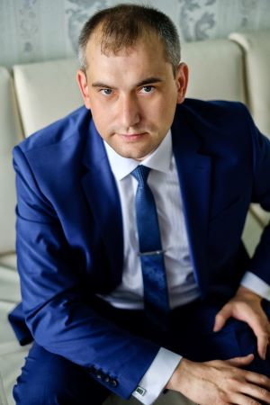

# Вячеслав Синников

### О себе:
> Возраст 34 года, дата рождения 16.07.1987 г.
> Образование: среде-техническое, " Техническая эксплуатация гидравлических машин, гидроприводов и гидропневмоавтоматики". ЧКПА, 2008 г.
> С 11.2021 прохожу обучение по курсу "Java разработчик" от образовательной платформы "Нетология". 

### Работа:
C 2017 г. - ПАО "Ростелеком", инженер электросвязи;

### Навыки:
* Выполнение ремонтно-настроечных и профилактических работ на оборудовании сети передачи данных (маршрутизаторы, коммутаторы),
расположенном на центральных узлах/ узлах агрегации/ периферийных узлах/ узлах доступа;
* Выполнение работ на станционном оборудовании, сетей доступа технологий PON, FTTx;
* Выполнение аварийно-восстановительных работ на вспомогательном оборудовании;
* Диагностика состояния элементов сети;
* Осуществление технического надзора и приемки в эксплуатацию элементов сети на местах.

### Дополнительная информация:
* опыт работы в крупнейшем в России интегрированном провайдере цифровых услуг и решений более 5 лет.

